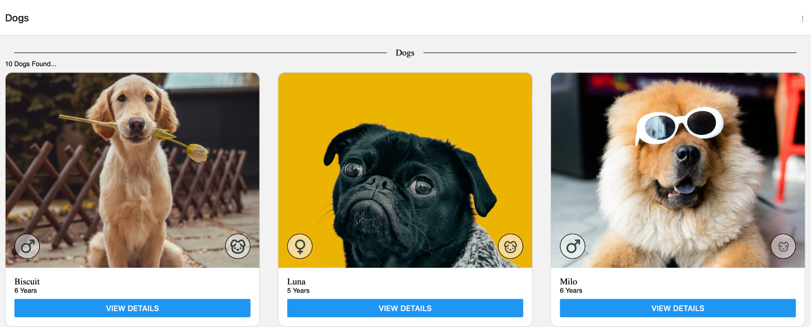
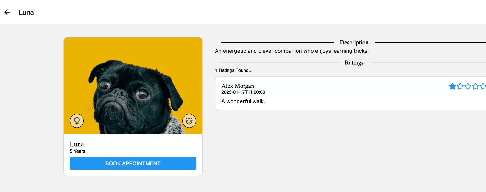
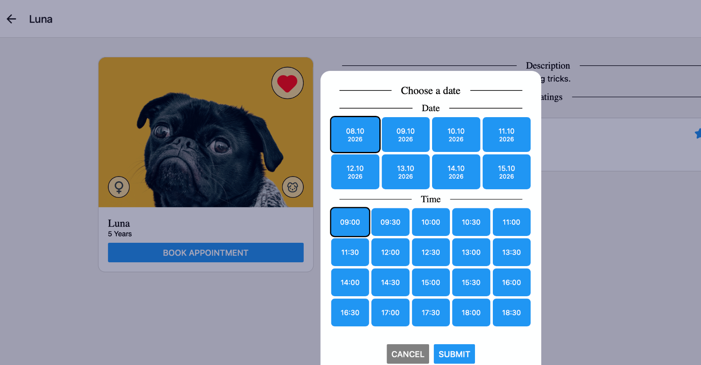

# PawPlan React Native

PawPlan is a volunteer-coordination platform for animal shelters.

This repository contains a focused **React Native and TypeScript migration prototype** that explores how selected PawPlan mobile workflows can be implemented as a shared application for **Android and iOS**.

The current vertical slice covers the path from browsing dogs to viewing details and booking a walking appointment, including authentication redirects, cancellation and returning to the originating dog.

> **Project status:** This is an early migration prototype under active development. It is not a production release or a complete replacement for the existing PawPlan applications.

**Live demo:** https://pawplan-reactnative.vercel.app/dogs/overview

## What this prototype demonstrates

The current implementation focuses on a small but complete workflow:

* Browse available dogs
* View information about an individual dog
* Mark dogs as favourites
* Start an appointment booking from the dog details screen
* Redirect unauthenticated users through login and resume the original booking intent
* Select a date and time and submit an appointment request
* Cancel booking or authentication and return to the originating dog
* Preserve route parameters across modal navigation
* Handle loading, empty, error, disabled and submitting states
* Expose important interactions through accessible roles, labels and state
* Test components, repository integration and Expo Router flows

The scope is intentionally limited. The objective is to establish a maintainable React Native foundation and evaluate the architectural, accessibility and user-experience implications of sharing functionality across Android and iOS.

## Screenshots

### Dog overview



### Dog details



### Appointment booking



## Why React Native?

PawPlan already includes separate implementations built with React/TypeScript, Kotlin/Android and Swift/SwiftUI.

The React Native prototype explores:

* Reusing existing React and TypeScript knowledge in a native mobile environment
* Sharing application and UI logic between Android and iOS
* Preserving clear boundaries between presentation, domain logic and data access
* Adapting web-oriented components and interaction patterns to native mobile conventions
* Supporting platform-specific behaviour where a shared implementation is not appropriate
* Maintaining accessibility across both mobile platforms
* Keeping data access replaceable through repository abstractions

The intention is not to make the platforms artificially identical. Shared code should be used where it improves maintainability without compromising native behaviour or the user experience.

## Implemented workflow

### Dog overview

Volunteers can browse the available dogs.

The overview demonstrates:

* Reusable React Native components
* Typed component properties and domain models
* Repository-backed data
* Responsive list layouts
* Accessible images and actions
* Favourite state for authenticated volunteers

### Dog details

The detail screen contains information about an individual dog and exposes the appointment action.

This part of the prototype demonstrates:

* Cross-screen navigation with Expo Router
* Route parameter handling
* Reusable presentation components
* Clear information hierarchy
* Screen-reader-compatible headings, images and controls
* Repository-backed ratings

### Appointment booking

The appointment flow connects dog details, authentication and booking through a route intent.

The current implementation supports:

* Starting a booking for a specific dog
* Redirecting unauthenticated users to login
* Returning to the pending booking after authentication
* Preserving the selected dog across the redirect
* Selecting a date and time
* Disabled and submitting states
* Accessible error feedback
* Returning to the originating dog after submission
* Returning to the originating dog when booking or login is cancelled

## Technologies

The prototype uses:

* **React Native**
* **TypeScript**
* **Expo**
* **Expo Router**
* **React Native StyleSheet**
* **Jest**
* **React Native Testing Library**
* **Firebase / Firestore repository implementations**
* **Git**

Mock repositories are used as the default data source while the architecture is being validated. Firebase-backed repository implementations are being developed behind the same interfaces.

## Architecture

The prototype separates presentation, domain models, navigation and data access.

Key ideas include:

* Screen and feature components for user workflows
* Reusable UI components
* Typed domain models
* Repository interfaces independent of Firebase
* Dependency injection through React context
* Mock and Firebase repository implementations behind the same contracts
* Navigation helpers around Expo Router
* Explicit loading, success, empty and error states
* Testable application logic

A simplified project structure:

```text
src/
  app/            Expo Router screens and modal routes
  components/     Reusable UI components
  domain/         Domain models, enums and utilities
  features/       Feature-specific presentation
    dogs/
    appointments/
  hooks/          Navigation and responsive-layout hooks
  mock/           Mock repository implementations
  services/       Firebase and toast integrations
  shared/         Repository contracts, providers and shared application logic

__tests__/
  components/
  features/
  navigation/
```

The UI depends on repository abstractions rather than Firebase directly. This allows the same workflows to be exercised against predictable mock data in development and tests while keeping Firebase integration replaceable.

## Accessibility

Accessibility is treated as part of the implementation rather than a later addition.

The current prototype includes:

* Meaningful accessibility labels and roles
* Accessible heading structure
* Descriptive image alternatives
* Selected, disabled and busy accessibility state
* Decorative icons hidden from the accessibility tree
* Modal accessibility semantics
* Accessible error feedback and live regions
* Controls that can be queried in tests through their accessible names

Manual VoiceOver and TalkBack validation remains part of the ongoing accessibility pass.

This work builds on accessibility improvements made to the PawPlan React web application, including semantic structure, keyboard navigation, accessible form handling and screen-reader support.

## Testing

The prototype uses **Jest**, **React Native Testing Library** and **Expo Router testing utilities**.

Current tests cover:

* Date and time selection controls
* Selected and disabled accessibility state
* Favourite-button behaviour and accessible state
* Dog-card navigation
* Repository-to-hook-to-UI integration in the dog overview
* Appointment-dialog interaction and error behaviour
* Authentication redirects during booking
* Preservation of the selected dog across authentication
* Successful booking returning to the originating dog details screen
* Booking cancellation returning to the originating dog
* Login cancellation returning to the originating dog

The tests intentionally focus on user-observable behaviour and accessible roles and labels rather than component implementation details.

End-to-end device testing and store-distribution workflows are outside the scope of this initial prototype.

## Running the project

Install dependencies:

```bash
npm install
```

Start the Expo development server:

```bash
npx expo start
```

The application can then be opened using:

* An Android emulator
* An iOS simulator
* A compatible physical development device

Run the automated checks with:

```bash
npm test
npm run lint
```

## Broader PawPlan platform

PawPlan is being developed as a multi-platform product rather than as several identical applications. Each existing implementation has a different focus.

### React web application

The React and TypeScript web application focuses primarily on shelter-management functionality:

* User and role management
* Dog management
* Appointment management
* Accessible browser-based workflows

### Native Android application

The Kotlin application focuses on the volunteer experience before and during a walk:

* Appointment booking
* Route tracking using location services
* Incident reporting
* Appointment-related notifications
* Background and lifecycle-aware functionality

### iOS prototype

The Swift and SwiftUI application was the first mobile implementation and serves as an initial prototype of PawPlan's core appointment workflows.

### React Native prototype

This repository evaluates which parts of the mobile experience can be implemented effectively through a shared React Native and TypeScript codebase while preserving appropriate native behaviour.

## Motivation

PawPlan originated from my own experience as an animal-shelter volunteer.

Finding time to volunteer can already be difficult, and coordinating available volunteers, dogs and suitable walking times adds further friction. PawPlan explores how software can simplify that coordination and make it easier for volunteers to turn their intention to help into action.

The project has since grown into an opportunity to explore user-centred, accessible web and mobile development across multiple platforms while working on a product based on a real-world need.

## Current limitations

This repository represents a focused technical prototype.

It does not currently claim:

* Feature parity with the native Android application
* Complete production-ready Firebase/Firestore integration
* Production-ready authentication
* Background location tracking
* Push-notification support
* App Store or Google Play distribution
* Production React Native experience

These areas can be evaluated incrementally after the initial cross-platform workflow and architecture have been validated.